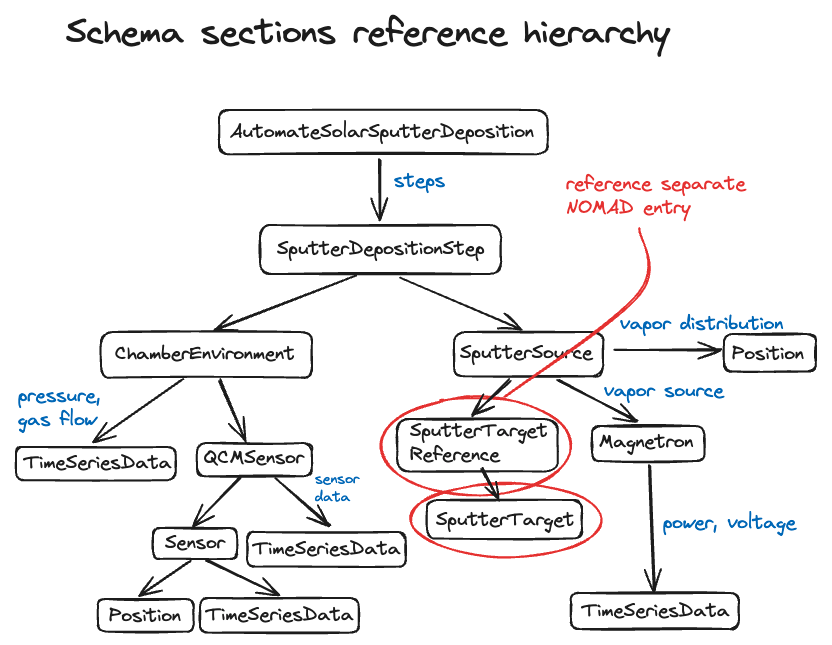

# Documentation for Jens & Co

This repo shows how we incorporated NOMAD in our self-driving magnetron sputtering lab setup. You can use this repository as an example to supplement the [NOMAD documentation](https://link-url-here.org](https://nomad-lab.eu/prod/v1/staging/docs/)).

## The setup

Our self-driving lab (SDL) runs in a loop. In each iteration, the following occurs:

1. The computer-controlled magnetron sputtering equipment outputs experiment data: [data.json](data/data.json).
2. We translate the output data to a YAML file and then zip it. The YAML file references a YAML schema already uploaded to NOMAD via: 
`'m_def' : "../uploads/vI_FnRuhR8Seh1nGrXttWw/raw/automate-solar_schema.archive.yaml#/definitions/section_definitions/AutomateSolarSputterDeposition"`.
See `data_to_zip` in [nomad_upload.py](nomad_upload.py).
3. We upload the zipped file to NOMAD. See `upload_zip` in [nomad_upload.py](nomad_upload.py).

## Getting started

### 1. Access NOMAD

First, you need access to a NOMAD instance. You can either upload directly to the central NOMAD servers or set up a private instance, which becomes a NOMAD Oasis. 
The [NOMAD documentation](https://link-url-here.org](https://nomad-lab.eu/prod/v1/staging/docs/)) should tell you everything you need to know.

### 2. Define a schema (optional)

A schema adds functionality to an ELN (the thing that displays the NOMAD entry). The schema defines the structure of your data files. If there is no schema, there won't be much more than raw data in your uploads.

You can use predefined schemas provided by NOMAD or create your own. In this project, we created a schema that inherits properties from a more general physical vapor deposition schema provided by NOMAD. 
You can find it in [automate-solar_schema.archive.yaml](schema/automate-solar_schema.archive.yaml). 

If the nested section references give you a headache, I created the following image:

  

Again, the NOMAD docs are best for understanding data structures and creating custom schemas. Ours is just an example.

### Upload data

Now you're ready to upload. Again, the NOMAD docs provide a general understanding of how uploads should be handled.

In our case, we're building a self-driving lab, meaning uploads are processed automatically. We also have a separate schema. 
Therefore, we first publish the schema separately and use its upload ID as a static reference in our upload files, as mentioned in point 2 of [The setup](#the-setup).
I included the schema in this repository to show it, but it is not used in any of our scripts.

## Remarks
- Dumping the files is unnecessary/superfluous. Ideally, we would like to push data directly to NOMAD via the API. Uploading a ZIP file
was the only thing that worked for us given NOMAD's documentation. Consider improving this.
- Since we are deploying a self-driving lab, we are taking extra steps to automate the upload process.
If this is not your intended use case, consider using NOMAD's drag-and-drop functionality and cutting out the automation steps.
- In the notebooks folder, I cover how data uploaded to NOMAD can be retrieved. While I was developing this, we transitioned from using a local database to NOMAD in our setup.
As such, we only automated nomad uploading but not processing data retrieved from NOMAD. NOMAD offers Python packages for parsing data. This might be worth looking into.
I left the notebooks as examples of how to download our uploaded entries from NOMAD. 

